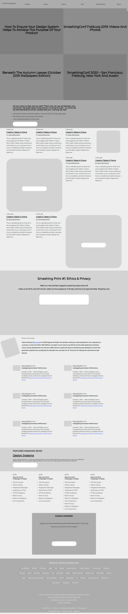

# Design Teardown

The Design Teardown project is a grayscale heat map of the smashing magazine website that indicates which elements have the greatest weight in the visual hierarchy.

[Click to go to Original Website ](https://www.smashingmagazine.com/)

For inspiration, check out [this image from vanseodesign.com](https://web.archive.org/web/20170628134444/http://www.vanseodesign.com/blog/wp-content/uploads/2009/12/visual-hierarchy-compared.png) which compares a site layout with no differentiation on the left to one with a thoughtful hierarchy on the right. Your final product will look much like the site on the right.

## Authors

This project was executed by the duo of :

- [Mohamed Naser](https://www.linkedin.com/in/mohamednaseramein/)
- [Marcos Medeiros](https://www.linkedin.com/in/marcos-medeiros-6a079a18a/)

## Used Tools

- HTML
- CSS
- Gulp
- NPM
- auto prefixer
- Flex & Grids
- FontAwsome v5.11.2
- MarkDown Syntax
- Gulp

## Done Work

- [x] create gulpfile.js
- [X] Create Nav Bar Section
- [x] Create Latest Articles Section
- [x] Crete MemberShip Section
- [X] Create Ethics & Privacy Section
- [X] Create Person of the week Section
- [x] Create Readers Comments Section
- [x] Create Featured Smashing Book Section 
- [x] Create Curated Posts Section 
- [x] Create Smashing Section  
- [x] Use Semantic HTML
- [x] Use Flex and Grids
- [x] check CSS with stylelint
- [x] Check html with W3C validator
- [x] Validate Readme file with markdown lint

## Setup

Open your git bash and cd to the location you'd like to put your files the run the command below.

```console
git clone https://git@github.com:mohamednaser/Design-Teardown.git
```

## Live Version

Live version [here](https://mohamednaser.github.io/Design-Teardown/) [pending].

## ScreenShot For Page


